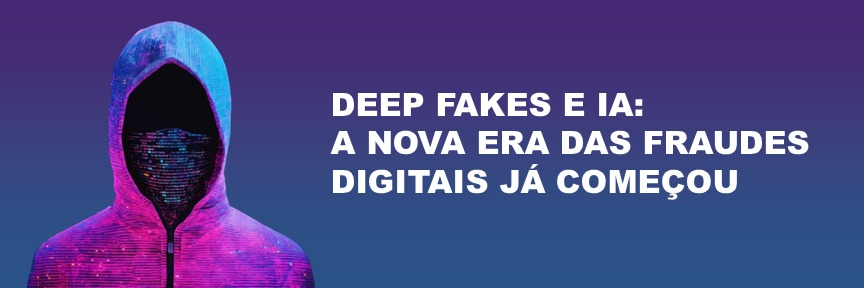

    

  
  

-------

  

# Projeto artigo técnico gerado por I.A.s

 > ℹ️ **NOTE:** Este é o repositório desenvolvido durante o curso no qual fui instrutor técnico na plataforma da [DIO](https://dio.me).

Projeto com o objetivo de gerar um artigo técnico com um layout rico, leitura agradável e com foco em promover sua autoridade técnica.

<a href="[https://web.dio.me/articles/diretivas-estruturais-versus-diretivas-de-atributo-qual-usar-no-angular?back=%2Farticles&page=1&order=oldest#state=044ab194-1e3a-4b8e-95fe-c0f6b3b5260e&session_state=efdc9591-d6fe-4d79-ae97-e58af45061da&code=5ac231e4-c722-46c3-bb7f-32ce5363fb78.efdc9591-d6fe-4d79-ae97-e58af45061da.a889d5a2-0d02-46df-83a5-28a1b4ac39ab](https://web.dio.me/articles/deepfakes-e-inteligencia-artificial-a-nova-era-das-fraudes-digitais-ja-comecou-e6edfb81c814)
" title="View PDF now"> 📕Clique aqui para ler o artigo</a>

## 💻 Tecnologias utilizadas no projeto

- [ChatGPT](https://chat.openai.com/) - para título e conteúdo
- [Lexica.art](https://lexica.art/) - para gerar imagens
- [PowerPoint](https://www.microsoft.com/en/microsoft-365/powerpoint) - Para formatação de banners e Layouts

## 📄 Prompts e ferramentas

ChatGPT：

|   Ação   | prompt                                                                                                                                                                                                                                                                         |
| :------: | ------------------------------------------------------------------------------------------------------------------------------------------------------------------------------------------------------------------------------------------------------------------------------ |
|  título  | Deepfakes e Inteligência Artificial: A Nova Era das Fraudes Digitais Já Começou                                                                                                                                                                                   |
| conteúdo | Escreva o artigo de forma simples que uma pessoa leiga possa ler e entender facilmente. Use exemplos atuais. |

Lexica.art：

- No léxica utilizamos o acervo público de imagens geradas por outras pessoas, os termos de pesquisa que utilizei durante a gravação do conteúdo foram:

• Angular

## ✨ Features

- Conteúdo gerado via ChatGPT
- Imagens do acervo público geradas via Lexica.art

## 📚 Materiais

- prompts utilizados:
- "Sugira 3 temas atuais sobre IA"
- resposta:
- 1. IA Generativa na Educação: Transformando o Aprendizado
💡 Como ferramentas como ChatGPT, Gemini e Claude estão revolucionando a forma como estudantes aprendem, professores ensinam e instituições avaliam.
Subtópicos sugeridos:
Tutores virtuais personalizados com IA
Produção automatizada de conteúdo didático
Desafios éticos e riscos de plágio
Educação inclusiva e acessível com IA

2. O Impacto da IA no Mercado de Trabalho em 2025
💡 Profissões que estão surgindo, funções que estão desaparecendo e como se preparar para o futuro dominado por IA.
Subtópicos sugeridos:
Novas carreiras com foco em IA e dados
A importância das habilidades humanas (soft skills)
Automação de tarefas administrativas e operacionais
Como a IA está moldando processos de RH e recrutamento

3. Privacidade e Segurança em Tempos de IA Avançada
💡 O crescimento das IAs está desafiando leis, empresas e indivíduos a repensarem o uso de dados e proteção de identidade.
Subtópicos sugeridos:
Vazamento de dados e uso indevido por modelos de IA
Regulações como a LGPD e a IA Act na Europa
IA e deepfakes: o novo cenário de fraudes digitais
Boas práticas para desenvolvedores e usuários

- prompts utilizados:
- "Vamos desenvolver sobre o tema IA e deepfakes: o novo cenário de fraudes digitais. Escreva o artigo de forma simples que uma pessoa leiga possa ler e entender facilmente. Use exemplos atuais."
- Resposta:
- Deepfakes e Inteligência Artificial: A Nova Era das Fraudes Digitais Já Começou
👀 O que você vê… pode não ser real.
Imagine receber uma ligação do seu chefe pedindo uma transferência urgente de dinheiro. A voz é dele, o jeito de falar também. Mas... não era ele. Era um deepfake de voz. Esse tipo de golpe está acontecendo hoje, e é só uma das formas como a inteligência artificial (IA) está sendo usada para fraudes.

Neste artigo, você vai entender de forma simples o que são os deepfakes, por que eles são perigosos e como se proteger.

🤖 O que são deepfakes?
Deepfake é uma palavra que junta deep learning (aprendizado profundo) com fake (falso). São vídeos, áudios ou imagens gerados por inteligência artificial que imitam pessoas reais de forma muito convincente.

Com essa tecnologia, é possível:
Colocar o rosto de uma pessoa em um corpo diferente;
Fazer um político dizer algo que nunca disse;
Copiar a voz de alguém com apenas alguns segundos de áudio.

🧪 Como isso é feito?
Antigamente, só especialistas conseguiam fazer esse tipo de montagem. Hoje, existem aplicativos gratuitos que qualquer pessoa pode usar para criar vídeos falsos em minutos.

A IA aprende com fotos e vídeos reais da pessoa e usa isso para criar novas imagens ou sons que parecem verdadeiros. Quanto mais material a IA tiver para "estudar", mais realista fica o resultado.

⚠️ Casos reais assustadores
Golpe com a voz do CEO:
Em 2023, uma empresa na Europa perdeu mais de R$ 1 milhão depois que um funcionário recebeu uma ligação falsa do "chefe", pedindo uma transferência urgente. A voz era idêntica à do CEO — mas era um deepfake.

Vídeos políticos falsos:
Durante as eleições na Argentina e nos Estados Unidos, circularam vídeos de políticos dizendo coisas que nunca disseram. Isso confunde os eleitores e pode mudar o resultado de uma eleição.

Golpes com vídeos íntimos:
Algumas pessoas têm seus rostos colocados em vídeos comprometidos para chantageá-las. Mesmo sendo falsos, causam vergonha e danos emocionais.

🔐 Como se proteger?
Desconfie de mensagens ou ligações fora do normal. Se algo parecer estranho, confirme por outro canal.

Evite expor sua voz e imagem desnecessariamente em redes sociais.
Não clique em links de vídeos suspeitos enviados por e-mail ou WhatsApp.
Empresas devem ter processos de verificação antes de autorizar pagamentos.
Use a verificação em dois fatores sempre que possível.

📜 E a lei, como fica?
A tecnologia avança mais rápido do que as leis. Em alguns países, como nos Estados Unidos e na Europa, já existem discussões e projetos de lei para punir o uso malicioso dos deepfakes.

No Brasil, a LGPD (Lei Geral de Proteção de Dados) protege o uso indevido da sua imagem e voz, mas ainda falta uma legislação específica para IA.

✅ Conclusão
A IA trouxe muitas facilidades, mas também está sendo usada para enganar, manipular e cometer crimes. Os deepfakes são um dos maiores desafios dessa nova era digital.

Por isso, ficar bem informado é a melhor forma de se proteger.

📣 Gostou do artigo?
Compartilhe com seus amigos e familiares para que mais pessoas fiquem alertas sobre esse perigo moderno.
💬 Você já viu um deepfake ou conhece alguém que caiu em um golpe digital? Conta pra gente nos comentários!

## 🛠️ Instruções de execução

Utilize os prompts acima nas ferramentas sugeridas para gerar o material base e utilize uma ferramenta de edição de documentos como power point, libreoffice , indesign para diagramação, o passo a passo em vídeo pode ser conferido na plataforma da [DIO](https://dio.me).

## 👨‍💻 Expert

    
    
&nbsp&nbsp&nbspLeandro Silveira 
    &nbsp&nbsp&nbsp
    <a href="https://github.com/leandrog7s">
    GitHub</a>&nbsp;|&nbsp;
    <a href="https://www.linkedin.com/in/leandro-silveira-30146513/">LinkedIn</a>
&nbsp;|&nbsp;
&nbsp;|&nbsp;

  

---

⌨️ com 💜 por [Leandro Silveira](https://github.com/leandrog7s)
